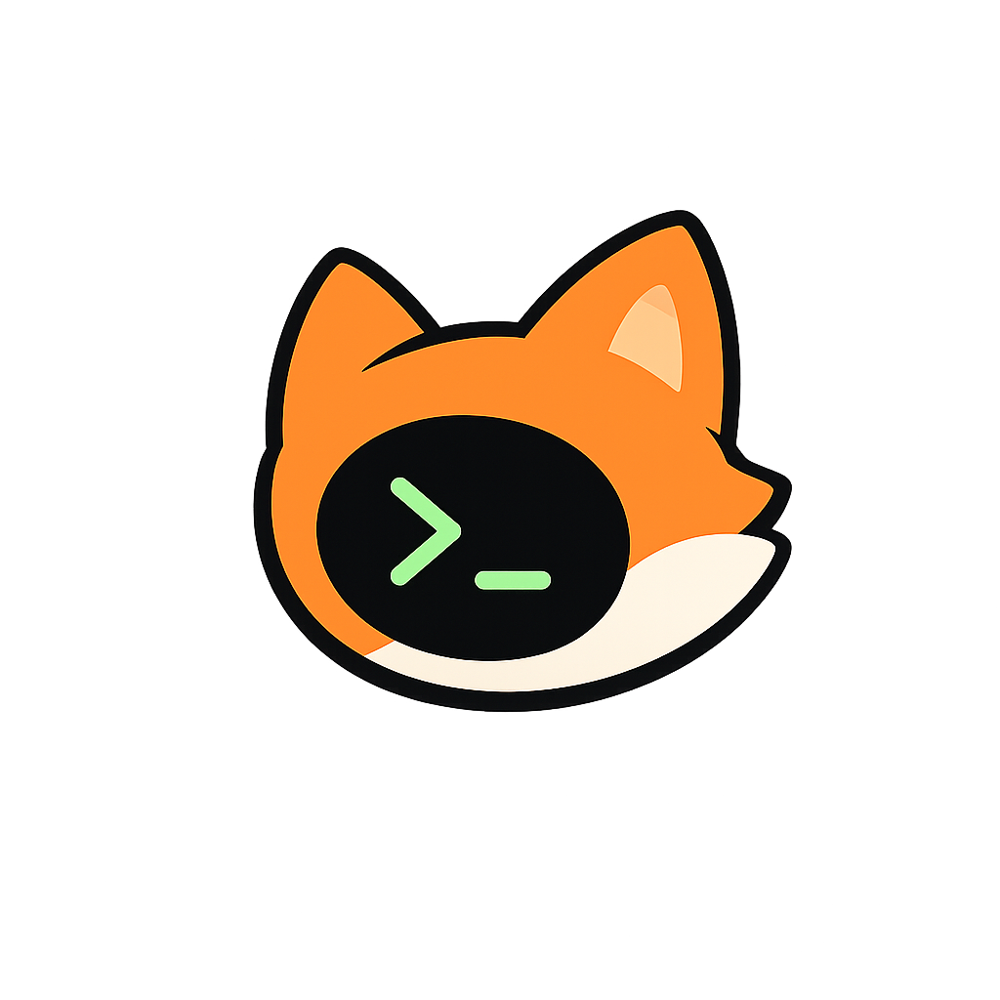

# Yinx 

A terminal HTTP client with streaming support, workflow orchestration, and import capabilities. Built in Rust with a Ratatui TUI.

> **Status**: Early development. Phase 1 (Core Domain Types) and Phase 2 (HTTP Engine Basics) are complete.

## Features

- [x] **Core Domain Types** -- Request, Response, Timing, and State models with full serialization
- [x] **HTTP Engine** -- Async client with streaming, timeouts, auth, and cookie support (21 tests)
- [ ] **Streaming Engine** -- Chunked, SSE, and JSON streaming with live rendering
- [ ] **Import System** -- Curl, Postman, Insomnia, and OpenAPI parsers
- [ ] **Workflow Engine** -- Graph-based request chaining with variable extraction
- [ ] **TUI** -- Full terminal UI with vim-style navigation
- [ ] **CLI** -- Scriptable command-line interface
- [ ] **Time-Travel** -- Response timeline scrubbing and replay

## Project Structure

```
├── crates/
│   ├── yinx-core/       [done] Domain types, state, events (135 tests)
│   ├── yinx-http/       [done] HTTP client + streaming engine (21 tests)
│   ├── yinx-workflow/   [todo] Graph-based workflow engine
│   ├── yinx-storage/    [todo] Persistence (JSON/SQLite)
│   ├── yinx-import/     [todo] Postman/Insomnia/curl/OpenAPI parsers
│   ├── yinx-tui/        [todo] Ratatui UI layer
│   └── yinx-cli/        [todo] CLI without TUI
├── public/              [done] Assets (mascot, etc.)
├── src/                 [todo] Main binary (glue)
└── Cargo.toml           Workspace root
```

## Building

```bash
cargo build
```

## Testing

```bash
cargo test --all
cargo test --package yinx-core  # Core domain tests (135 passing)
```

## Linting

```bash
cargo clippy -- -D warnings
cargo fmt
```

## Roadmap

| Phase | Description | Status |
|-------|-------------|--------|
| 0 | Project Scaffolding | Done |
| 1 | Core Domain Types | Done |
| 2 | HTTP Engine Basics | Done |
| 3 | Storage Layer | Pending |
| 4 | Streaming Engine | Pending |
| 5 | Import System | Pending |
| 6 | Workflow Engine | Pending |
| 7-8 | TUI Foundation + Panes | Pending |
| 9 | External Editor Integration | Pending |
| 10 | Time-Travel + Replay | Pending |
| 11 | Observability Panel | Pending |
| 12 | CLI Mode | Pending |
| 13 | Curl Compatibility | Pending |
| 14 | Configuration & Settings | Pending |
| 15 | Integration + Polish | Pending |

## Keyboard Shortcuts

Yinx uses terminal-native, vim-inspired keybindings:

### Pane Navigation
| Shortcut | Action |
|----------|--------|
| `Tab` / `Shift+Tab` | Cycle panes forward/backward |
| `Ctrl+1` | Request pane |
| `Ctrl+2` | Response pane |
| `Ctrl+3` | Workflow pane |
| `Ctrl+4` | Logs pane |

### Cursor Movement (within panes)
| Shortcut | Action |
|----------|--------|
| `h` `j` `k` `l` | Left, Down, Up, Right |
| `gg` | Go to top |
| `G` | Go to bottom |
| `Ctrl+u` | Page up |
| `Ctrl+d` | Page down |

### Actions
| Shortcut | Action |
|----------|--------|
| `Ctrl+r` | Send request |
| `Ctrl+w` | Toggle workflow pane |
| `i` | Enter insert mode |
| `v` | Enter visual mode |
| `Esc` | Exit to normal mode |
| `/` | Search |
| `T` | Cycle themes |
| `q` | Quit / close overlay |

### Modes
- **Normal**: Navigation and actions (default)
- **Insert**: Text input and editing
- **Command**: Command palette input

## License

MIT
